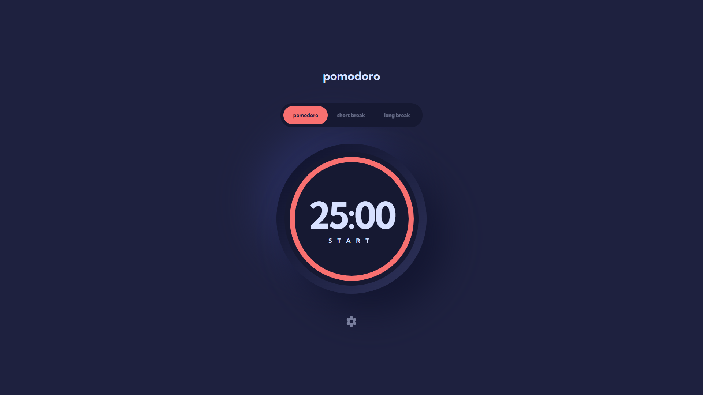
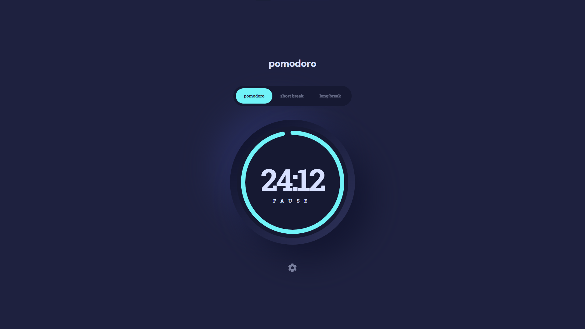
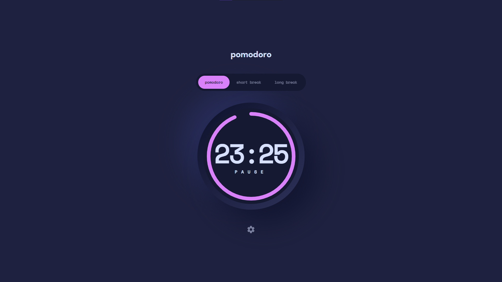
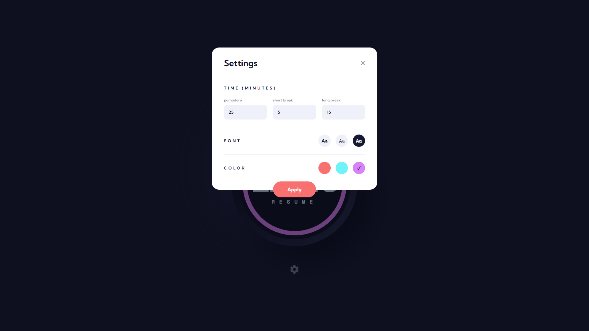

# Frontend Mentor - Pomodoro app solution

This is a solution to the [Pomodoro app challenge on Frontend Mentor](https://www.frontendmentor.io/challenges/pomodoro-app-KBFnycJ6G). Frontend Mentor challenges help you improve your coding skills by building realistic projects.

## Table of contents

- [Overview](#overview)
  - [Screenshot](#screenshot)
  - [Links](#links)
- [My process](#my-process)
  - [Built with](#built-with)
  - [What I learned](#what-i-learned)
  - [Continued development](#continued-development)
- [Author](#author)

## Overview

🍅 Pomodoro App to keep productive. User is able to:

- Set a pomodoro timer and short & long break timers
- Customize how long each timer runs for
- See a circular progress bar that updates every minute and represents how far through their timer they are
- Customize the appearance of the app with the ability to set preferences for colors and fonts

### Screenshot






### Links

- Live Site URL: [https://bbualdo-pomodoro.vercel.app]
- Solution URL: [https://www.frontendmentor.io/solutions/react-typescript-sass-pomodoro-app-DqQVtxgkhc]

## My process

1. First of all I set up file and folder structure and I tried to keep it clear during process.
2. Then I declared **Sass** variables for colors and fonts.
3. And then I built and styled header and navbar, meanwhile I had to declare enum to dynamically style choosen timer.
4. After that I build and styled timer circle. I used **React Countdown Timer Circle**. It was my first touch with that library, so I customized it with documentation to suit my project.
5. Then I used Portals to implement settings Modal with backdrop.
6. When every element of the app was built and styled I focused on implementing complete interactivity:

- I thought that implementing color and font change will be the easiest logic to code - I was wrong. But this came with understanding of various features of **React** and **TypeScript** 😀
- implementing remaining time display based on input value wasn't much more than a formality at this point

7. Then I just copy-pasted 3 Timers for Pomodoro, Short and Long Break.
8. To make my code lighter and more reusable I made one Timer template and built these 3 Timers based on it.
9. At the end I just tweaked some styling to make the app look good at mobile devices.

### Built with

- React
- TypeScript
- Sass/SCSS
- Semantic HTML5 markup
- [react-countdown-circle-timer](https://www.npmjs.com/package/react-countdown-circle-timer)

### What I learned

Most of all, I'm proud of myself for understanding React Context, Custom Hooks and TypeScript's enums and interfaces 😁

```ts Creating Context
import { createContext } from 'react';
import { Colors, Fonts } from '../ts/enums';

const initialState = {
	font: Fonts.KUMBH,
	color: Colors.RED,
	timers: {
		pomodoro: 25,
		shortBreak: 5,
		longBreak: 15,
	},
};

const SettingsContext = createContext(initialState);

export default SettingsContext;
```

```ts Using it in Custom Hook
import { useContext } from 'react';
import SettingsContext from '../context/SettingsContext';
import { ColorFormat } from 'react-countdown-circle-timer';
import { Colors, Fonts } from '../ts/enums';

const useSettings = () => {
	const ctx = useContext(SettingsContext);

	let selectedColor: ColorFormat;
	switch (ctx.color) {
		case Colors.RED:
			selectedColor = '#f87070';
			break;
		case Colors.CYAN:
			selectedColor = '#70f3f8';
			break;
		case Colors.PINK:
			selectedColor = '#d881f8';
			break;
	}

	let selectedFont: string;
	switch (ctx.font) {
		case Fonts.KUMBH:
			selectedFont = 'Kumbh Sans, sans-serif';
			break;
		case Fonts.ROBOTO:
			selectedFont = 'Roboto Slab, serif';
			break;
		case Fonts.SPACE:
			selectedFont = 'Space Mono, monospace';
			break;
	}

	return {
		color: selectedColor,
		font: selectedFont,
		timers: { ...ctx.timers },
	};
};

export default useSettings;
```

```tsx Using Custom Hook example
import useSettings from '../../hooks/useSettings';

//...

const { color, font } = useSettings();

//...

const Time = (props: { remainingTime: number }): JSX.Element => {
	let hoverClass: string = '';
	switch (color) {
		case '#f87070':
			hoverClass = 'action__red';
			break;
		case '#70f3f8':
			hoverClass = 'action__cyan';
			break;
		case '#d881f8':
			hoverClass = 'action__pink';
			break;
	}

	let buttonText: string = '';
	switch (status) {
		case Status.RUNNING:
			buttonText = 'Pause';
			break;
		case Status.PAUSED:
			buttonText = 'Resume';
			break;
		case Status.FINISHED:
			buttonText = 'Restart';
			break;
		default:
			buttonText = 'Start';
	}

	const minutes = String(Math.floor(props.remainingTime / 60)).padStart(2, '0');
	const seconds = String(props.remainingTime % 60).padStart(2, '0');
	const remainingTime = `${minutes}:${seconds}`;

	return (
		<div className={styles.time__container}>
			<h1 style={{ fontFamily: font }} className={styles.time}>
				{remainingTime}
			</h1>
			<button
				onClick={startPause}
				style={{ fontFamily: font }}
				className={`${styles.action} ${hoverClass}`}
			>
				{buttonText}
			</button>
		</div>
	);
};

//...
```

### Continued development

I understood Context so in my future projects I want to test out Zustand or Redux/Toolkit. Futhermore I want to continue developing in TypeScript because I understood power of this language.

## Author

- Website - [BBualdo](https://bbualdo-portfolio.netlify.app)
- Frontend Mentor - [@bbualdo](https://www.frontendmentor.io/profile/bbualdo)
